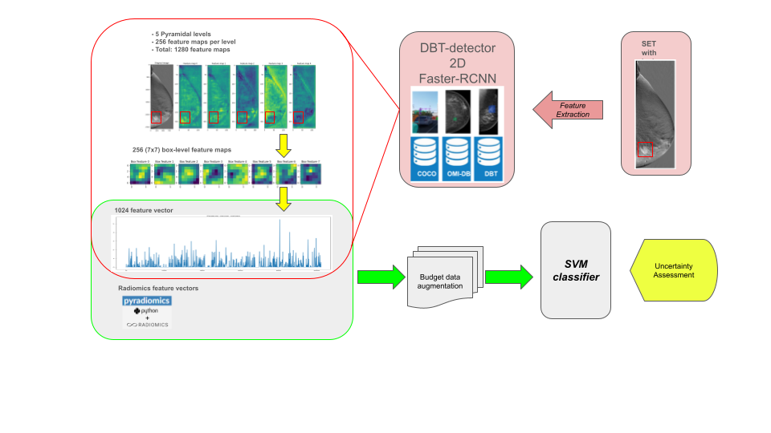

# Added value of feature uncertainty in the radiomic analysis of Contrast-Enhanced Digital Mammography images

This is the official implementation of the paper "Added value of feature uncertainty in the radiomic analysis of Contrast-Enhanced Digital Mammography images", presented in the [17th International Workshop on Breast Imaging (IWBI 2024)](https://www.iwbi2024.org/). 

## Abstract

Deep learning models are the state-of-the-art for most medical imaging application, including mammography. However, large amounts of data are generally required for their usage. Radiomic analysis has shown the potential to improve clinical decision support systems for small datasets. One of the challenges facing the clinical implementation of radiomics is reproducibility. Our goal is to show that assessing radiomic features uncertainty can improve the robustness and performance of radiomic-based prediction models for contrast-enhanced digital mammographic images (CEDM). Additionally, we propose the use of a pretrained tomosynthesis (DBT) lesion detection model as feature extractor for the boosting of the prediction framework. The prediction goal was the immunohistochemical status of breast cancer in 33 patients. We assessed two sources of uncertainty: misalignment between the subtracted images and region-of-interest delineation variability. Including uncertainties in the training step improved the performance of the prediction models, and the use of the DBT lesion detection model to boost the prediction improved the overall radiomic model performance for PR, ER and Ki67 receptors.

The following figure shows the proposed pipeline for the radiomic analysis of CEDM images: 

 